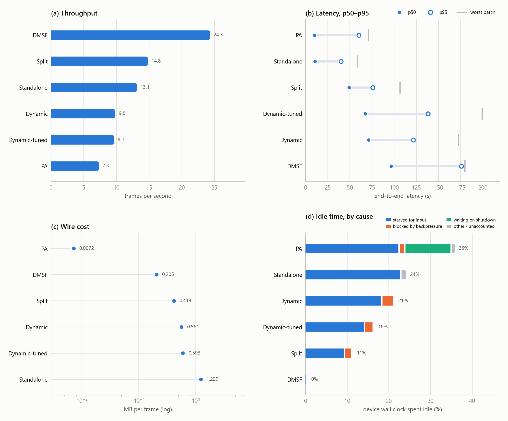

# Dynamic network — does adaptive cut-point selection help?

The Split codebase can move its cut point at runtime: a controller samples the
queue between edge and cloud and nudges the split layer to rebalance work. Under
a bandwidth-varying network that controller made throughput **worse**. This case
is the investigation and the retuned re-run.



## The three runs that matter

Same code, same video, same seeded bandwidth profile. One flag and one config
block differ.

| Run | Adaptive | fps | p50 latency | idle | MB/frame |
|---|---|---:|---:|---:|---:|
| **Split** | off, cut fixed at 10 | **14.8** | 49.1 s | 11.3% | 0.414 |
| Dynamic | on, defaults | 9.8 | 71.1 s | 21.3% | 0.561 |
| Dynamic-tuned | on, retuned | 9.7 | 67.1 s | 16.4% | 0.593 |

The other three rows in the figures (DMSF, Standalone, PA) are the same runs as
in [dynamic-all-projects](../dynamic-all-projects/), carried over for scale.

## What went wrong the first time

The controller's entire output for a 27-minute run was two log lines:

```
[Adaptive] controller started ... L=24, cap=15.0MB, initial cuts={...: 10}
[Adaptive] intermediate_queue_0: cut 10->9 shallower (cloud+) (high=0.00 low=1.00)
```

Three separate faults:

1. **It moved 48 s in, mid-warmup, and never revised.** Per batch, the two runs
   were identical before that nudge (3.20 s vs 3.27 s) and diverged sharply after
   it (2.12 s vs 3.25 s). Split came out of warmup; the adaptive run never did.
2. **`low=1.00` — the trigger was unanimous.** Under bandwidth shaping the queue
   sits empty because the *link* is the constraint: bytes are in flight, not
   queued. "Cloud starved" therefore reads true permanently, so no ratio
   threshold could have prevented it.
3. **It went blind.** No window ever closed again. The controller reads queue
   depth from RabbitMQ's management API — port 15672, which this experiment
   shapes — with a 2 s timeout, four times a second. Under load its own sensing
   channel is the first thing to starve.

## The retune, and what it proved

The adaptive block was changed to disable the harmful direction, bias toward the
other one, delay the first decision past warmup, and stop hammering the shaped
management port. **All three mechanisms worked:**

```
[Adaptive] controller started ... cap=11.0MB, initial cuts={...: 10}
[Adaptive] cut 10->11 deeper (edge+) (high=0.56 low=0.00)
[Adaptive] cut 11->14 deeper (edge+) (high=0.44 low=0.00)
[Adaptive] want deeper from cut 14 but no cut ≤ cap 11.0MB in that direction — staying
[Adaptive] want deeper from cut 14 but no cut ≤ cap 11.0MB in that direction — staying
```

`low=0.00` on both decisions: the shallower branch never fired again. Five log
lines instead of two: the controller stayed alive for the whole run.

**And throughput did not improve — 9.7 fps against 9.8.** The premise was wrong.
Deeper cuts were supposed to mean smaller feature maps and fewer bytes. Measured
inside the tuned run itself, by splitting the message series at the cut-change
timestamps:

| cut held | messages | mean MB |
|---|---:|---:|
| 9 (first run, most of it) | 56 | 17.95 |
| **10 — the static default** | 11 | **14.11** |
| 11 | 8 | 14.25 |
| 14 (77% of the tuned run) | 37 | 21.44 |

**The payload curve is non-monotonic and cut 10 already sits at the bottom of
it.** Moving shallower costs 27% more bytes; moving deeper to 14 costs 52% more.
The controller correctly identified a cloud-side bottleneck, correctly moved work
toward the edge, and made throughput worse, because on this model that trade buys
compute balance at the price of the resource that was actually scarce.

## The bug that is worth fixing

`max_message_mb` is meant to stop the controller choosing a cut whose messages
exceed the broker limit. Set to 11.0 MB, it **admitted cut 14**, whose real
messages average 21.4 MB and peak at 24.0 MB — over RabbitMQ's 16 MB default. It
also rejected cuts 12 and 13 as unsafe while passing 14, which is worse than
both. The estimate is not merely ~2× off in scale; its *ordering* is wrong, which
is why tightening the cap protected nothing.

The project ships the tool to fix it:

```bash
python tools/measure_cut_sizes.py --model yolo26n --batch_size 32 --compress --num_bit 8
```

Until that table reflects measured reality, the controller is choosing cuts from
a map that does not match the terrain.

## The figures

| File | What it shows |
|---|---|
| [`overview.png`](overview.png) | All four headline measures, six runs |
| [`throughput.png`](throughput.png) | Frames per second — Dynamic and Dynamic-tuned sit together, well below Split |
| [`latency_spread.png`](latency_spread.png) | p50, p95 and worst batch per run |
| [`tradeoff.png`](tradeoff.png) | Throughput against median latency |
| [`wire_cost.png`](wire_cost.png) | Bytes per frame — the ordering that explains the throughput ordering |
| [`idle_reasons.png`](idle_reasons.png) | Idle wall clock by cause; the tuned run's idle drops 21% → 16% |
| [`activity_heatmap.png`](activity_heatmap.png) | Transport dominates every split-style run |
| [`broker_ram.png`](broker_ram.png) | Broker memory above idle |

## What this case does and does not establish

It establishes that **on yolo26n at batch 32, the default cut of 10 is at or very
near the payload minimum**, so there is little for a cut-point controller to win
under bandwidth shaping — and that the controller's model of message size is
wrong by roughly 2× with the wrong ordering.

It does not establish that adaptive cut selection is useless in general. The
conclusion rests on four measured cut points (9, 10, 11, 14) from two runs. A
real per-cut size table would either confirm that cut 10 is optimal or point at a
better one in a single measurement, and that measurement is cheap compared to
another 25-minute fleet run.

Source: `visual_results/make_dynamic_imgs.py dynamic-tuned`; the retuned run was
produced by `controller/run-dynamic-tuned.sh` (not in this repository — it
carries lab credentials).
