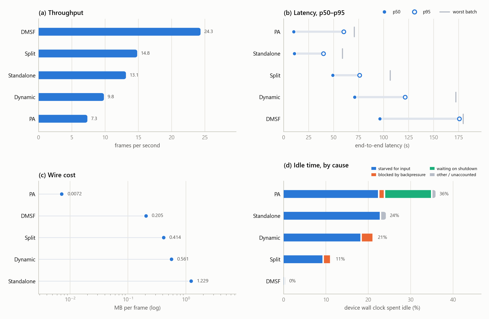

# Dynamic network — five projects

The same fleet and the same video as the static case, but every run passes
through a traffic shaper on the broker host: **Poisson bandwidth, mean 60 Mbit/s,
clamped to [10, 80], each rate held 60 s, seed 42**. Both AMQP (5672) and the
management API (15672) are shaped, in both directions.

Because the shaper is seeded, every run replays the same bandwidth sequence
minute for minute. That is what makes these five comparable to each other.

## The runs

One overnight schedule, six projects attempted, five archives written.

| System | fps | p50 latency | idle | MB/frame | broker RAM |
|---|---:|---:|---:|---:|---:|
| DMSF | 24.3 | 96.4 s | 0.4% | 0.205 | 362 MB |
| Split | 14.8 | 49.1 s | 11.3% | 0.414 | 483 MB |
| Standalone | 13.1 | 10.7 s | 24.1% | 1.229 | not measured |
| Dynamic | 9.8 | 71.1 s | 21.3% | 0.561 | 645 MB |
| PA | 7.3 | 10.2 s | 35.9% | 0.007 | 313 MB |

**Dynamic is Split's code with the adaptive cut-point controller enabled** — the
same directory, the same config, one flag different. It is on this chart to be
compared against Split directly, and it loses on every axis. Why is the subject
of [dynamic-adaptive-tuned](../dynamic-adaptive-tuned/).

## The figures

| File | What it shows |
|---|---|
| [`overview.png`](overview.png) | All four headline measures in one 2×2 panel |
| [`throughput.png`](throughput.png) | Frames per second across the whole fleet |
| [`latency_spread.png`](latency_spread.png) | Per-batch end-to-end latency: p50, p95, worst batch |
| [`tradeoff.png`](tradeoff.png) | Throughput against median latency |
| [`wire_cost.png`](wire_cost.png) | Megabytes one edge worker publishes per frame, log scale |
| [`idle_reasons.png`](idle_reasons.png) | Idle wall clock, split by cause |
| [`activity_heatmap.png`](activity_heatmap.png) | Share of device time by activity, ±1 s.d. across the run's clusters |
| [`broker_ram.png`](broker_ram.png) | Broker memory above its own idle baseline |

## Reading them

**Latency stretches far more than throughput contracts.** DMSF holds 24 fps but
its p95 batch takes 176 s. When the link is the bottleneck, work keeps flowing
but each individual batch spends a long time in transit — a system can look
healthy on a throughput chart and be unusable if you care about per-frame
delay.

**Wire cost predicts the ordering better than anything else here.** With the
notable exception of DMSF, the runs sort by bytes per frame: PA (0.007 MB) is
slowest for reasons of its own, but among the split-style runs, Split (0.414)
beats Dynamic (0.561) and the gap is close to the byte ratio. On a capped link
that is the expected result and it is worth checking before attributing a
difference to anything cleverer.

**The activity heatmap separates transport from compute.** Split and Dynamic
spend 73% and 65% of device wall clock in transport respectively, against 26%
and 18% in inference. These are not compute-bound runs, which is the fact any
scheduling decision here has to start from.

## Caveats

**DAG produced no archive and is absent from every figure.** Its server started
and logged `waiting for [9, 3] clients`, then nothing — the clients never
registered. It is missing, not zero, and the charts show five systems rather
than drawing a sixth empty row.

**PA hit the schedule's 1800 s budget.** The schedule stopped *waiting* at that
point and recorded a failure; PA's server kept running and wrote a complete
archive four minutes later. Its data is here and is as sound as the others —
only the schedule's verdict was negative.

**Standalone's broker RAM is genuinely absent**, not lost: its log reads
`source=none samples=0 (disabled in config)`. The chart says "not measured".

**Do not read these against the static figures as a controlled comparison.** The
static runs were taken across several days on an unshaped network; these were
taken in one overnight schedule under the shaper. The difference between the two
sets includes the network change and whatever else moved in between.

Source: `visual_results/make_dynamic_imgs.py` over `results dynamic network/`.
