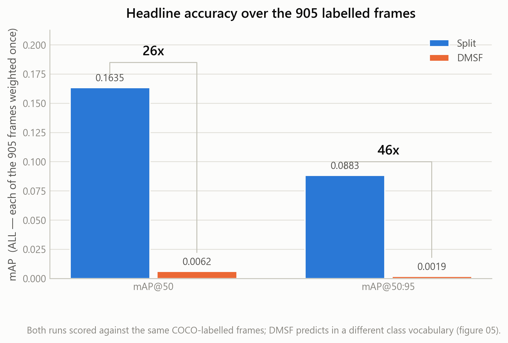

# Static network — detection accuracy, Split vs DMSF

Throughput charts say nothing about whether the detections were any good. This
case scores two runs against the same 905 COCO-labelled frames.

## The numbers

| Run | mAP@50 | mAP@50:95 | Ground-truth frames |
|---|---:|---:|---:|
| **Split** | **0.1635** | **0.0883** | 905 |
| DMSF | 0.0062 | 0.0019 | 905 |

Split scores roughly **26× DMSF on mAP@50** and 46× on mAP@50:95. DMSF's bars in
`01_headline.png` are drawn to scale and are consequently almost invisible — that
is the finding, not a rendering fault, so both bars carry a value label and the
multiple is stated on a bracket spanning each pair.

Read alongside [static-all-projects](../static-all-projects/), where DMSF has the
highest throughput of the six. **DMSF is the fastest run and the least accurate
one**, and neither chart alone would tell you that.

## The figures

| File | What it shows |
|---|---|
| [`00_overview.png`](00_overview.png) | Headline, window series and frame coverage in one panel |
| [`01_headline.png`](01_headline.png) | The `ALL` number — every scored frame weighted once |
| [`02_by_window.png`](02_by_window.png) | mAP per sliding window, both runs, same windows |
| [`03_dmsf_own_scale.png`](03_dmsf_own_scale.png) | DMSF alone, on its own y-scale, so its shape is legible |
| [`04_window_vs_all.png`](04_window_vs_all.png) | Window mean against the `ALL` figure — they are not the same statistic |
| [`05_class_vocabulary.png`](05_class_vocabulary.png) | Which classes appear in the ground truth at all |

## Why the trimming matters

The ground truth ends partway through a batch, so the last labelled batch is
`(905 - 1) // 32 = 28`. Only windows whose batch range ends at or before batch 28
are kept, which leaves both runs with the **same window count over the same
frames** — that is what makes two lines of equal length legitimate rather than
cosmetic.

This trim also changes DMSF's number. `WINDOW` in its own `map.log` is the
unweighted mean over *all* 29 windows it logged, not a statement about these 905
frames; over the 14 comparable windows it reads 0.0037 rather than the 0.0088 the
raw file suggests. `04_window_vs_all.png` is the chart that keeps those two
statistics separate.

## Caveat

Two runs, one video, one label set. This case establishes that these two
configurations differ enormously in accuracy on this workload. It does not
establish a general accuracy ranking between the approaches, and the
`05_class_vocabulary.png` panel exists to show how narrow the labelled class
vocabulary actually is before anyone generalises from these numbers.

Source: `visual_results/compare_map.ipynb` over `results static network/map/`.
