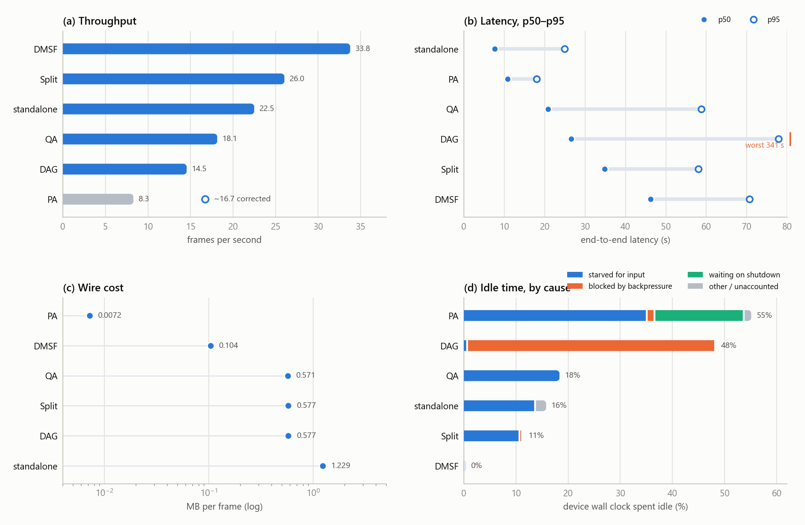

# Static network — all six projects

Six split-inference implementations run on the same 13-machine fleet against the
same video, on an **unshaped** network. Every number comes out of a log line the
run itself wrote; nothing here is re-simulated.

## The runs

| System | Configuration | fps | p50 latency | idle | MB/frame | broker RAM |
|---|---|---:|---:|---:|---:|---:|
| DMSF | baseline, split point 7 (auto), 1-bit | 33.8 | 46.3 s | 0.4% | 0.104 | 218 MB |
| Split | proposed, clustering on, 2 clusters, 8-bit | 26.0 | 34.9 s | 11.4% | 0.577 | 557 MB |
| standalone | per-batch routing, no compression | 22.5 | 7.7 s | 15.8% | 1.229 | not measured |
| QA | fixed cut-layer, clustering off, 8-bit | 18.1 | 20.9 s | 18.4% | 0.571 | 250 MB |
| DAG | pdd, 3 cloud stages, 8-bit | 14.5 | 26.5 s | 48.4% | 0.577 | 748 MB |
| PA | privacy-aware, 9 clusters, 24 splits | 8.3 | 10.9 s | 55.1% | 0.007 | 226 MB |

## The figures

| File | What it shows |
|---|---|
| [`overview.png`](overview.png) | All four headline measures in one 2×2 panel |
| [`throughput.png`](throughput.png) | Frames per second across the whole fleet |
| [`latency_spread.png`](latency_spread.png) | Per-batch end-to-end latency: p50, p95, worst batch |
| [`tradeoff.png`](tradeoff.png) | Throughput against median latency — the up-and-left corner is better |
| [`wire_cost.png`](wire_cost.png) | Megabytes one edge worker publishes per frame, log scale |
| [`idle_reasons.png`](idle_reasons.png) | Share of device wall clock spent idle, split by cause |
| [`activity_heatmap.png`](activity_heatmap.png) | Where device time actually goes: inference, codec, transport, capture |
| [`broker_ram.png`](broker_ram.png) | Broker memory above its own idle baseline |

## Reading them

**Throughput and latency are not two views of the same thing here.** standalone
has the lowest median latency (7.7 s) and middling throughput; DMSF has the
highest throughput and one of the highest latencies. `tradeoff.png` is the figure
that makes the two independent — a system can be fast per batch and slow overall
if it leaves devices waiting between batches.

**Wire cost spans two and a half orders of magnitude**, which is why that chart
is log-scaled. PA's 0.0072 MB/frame and standalone's 1.229 MB/frame are not
small and large versions of the same design decision; they are different
decisions about what crosses the network at all.

**Idle time is the story for DAG and PA.** Both spend roughly half their device
wall clock not working. `idle_reasons.png` separates *starved for input* (nothing
arrived) from *blocked by backpressure* (the downstream refused more) — those
call for opposite fixes, and lumping them into one "idle" number hides which one
you have.

## Caveats

**PA's own counter disagrees with its logs.** Its `DONE` counter reports 252
batches where the latency and utilization files show 504 completed. The chart
draws the reported 8.3 fps in a de-emphasised bar and marks the recomputed
~16.7 fps with a hollow ring — the reported value stays visible rather than
being quietly replaced. Treat PA's throughput as a range, not a point.

**DAG's worst batch is 341 s**, far off the scale of the latency chart. It is
clamped at the axis edge and labelled where it lands, so the p50/p95 comparison
across the other five stays readable.

**Two folder names on disk are crossed.** `results_standalone` holds the DMSF
run and `results_dmsf` holds the standalone one, identified from the folders'
contents rather than their names. The labels in these figures are correct; the
directory names they were read from are not. This matters only if you go back to
the raw data.

Source: `visual_results/compare_runs.ipynb` over `results static network/`.
