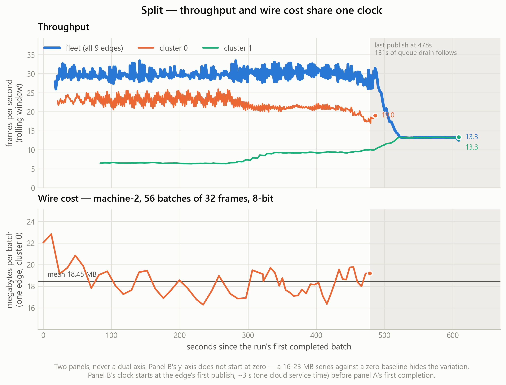

# Static network — inside one Split run

The [all-projects case](../static-all-projects/) gives Split one bar. This case
opens that bar up: throughput and wire cost over the run, per cluster and per
edge worker, for a single run on the unshaped network.

## What was measured

| Series | Source | n | min | mean | max |
|---|---|---:|---:|---:|---:|
| fleet window FPS | `batch_done_ns.log` | 489 | 12.48 | 28.32 | 33.43 |
| cluster 0 window FPS | `fps_cluster_ns.log` | 321 | 17.02 | 22.23 | 25.94 |
| cluster 1 window FPS | `fps_cluster_ns.log` | 153 | 6.33 | 9.57 | 13.32 |
| machine-2 MB per batch | `message_size_series.log` | 56 | 16.29 | 18.45 | 22.83 |

The run splits 9 edge workers across two clusters. **Cluster 0 sustains about
2.3× cluster 1's throughput** (22.2 vs 9.6 fps), and cluster 1 starts 62 s later
— visible as the offset between the two lines.

## The figures

| File | What it shows |
|---|---|
| [`01_fps_and_wire.png`](01_fps_and_wire.png) | Two stacked panels on a shared time axis: fleet FPS above, bytes on the wire below |
| [`02_fps_and_wire_indexed.png`](02_fps_and_wire_indexed.png) | The same two series on one axis, each indexed to its own mean = 100 |
| [`03_cluster0_fps.png`](03_cluster0_fps.png) | Cluster 0's throughput over the run |
| [`04_cluster0_edge_activity.png`](04_cluster0_edge_activity.png) | What each edge in cluster 0 was doing, over time |
| [`05_cluster0_edge_span.png`](05_cluster0_edge_span.png) | When each edge started and stopped — the stagger |
| [`06_cluster0_wire_per_edge.png`](06_cluster0_wire_per_edge.png) | Bytes published per edge, so one heavy worker is visible |
| [`07_cluster0_rate_vs_rate.png`](07_cluster0_rate_vs_rate.png) | Publish rate against completion rate |
| [`08_cluster0_payload_vs_fps.png`](08_cluster0_payload_vs_fps.png) | Message size against throughput within cluster 0 |
| [`09_payload_vs_fps_all_runs.png`](09_payload_vs_fps_all_runs.png) | The same relationship across every run, for context |

## Two deliberate choices in these charts

**FPS and megabytes get two stacked panels, not one dual axis.** They are
different measures in different units; the alignment between two y-scales is
arbitrary, so a dual axis draws a correlation that is not in the data. Figure 01
keeps both in their real units on a shared x-axis. Figure 02 is the honest way to
put them on *one* axis: index each series to its own mean and label the axis in
percent, so each line shows how far that measure moved relative to its own
typical value. What indexing costs is absolute magnitude, so both endpoints are
labelled in real units.

**The shaded band at the right is not missing data.** It marks the stretch after
the edge's last publish, when nothing new is entering the pipeline and the cloud
is draining what is already queued. Panel B has no points there because there is
nothing to have.

## Caveat

`fps_cluster_ns.log` writes a line per completed batch but only carries
`window_fps` once its rolling window has filled, so the first samples of each
cluster have no value and are dropped — 474 of 504 lines survive. That is the
file working as designed, not data loss.

Source: `visual_results/split_fps_wire.ipynb` over `results static network/results_split`.
