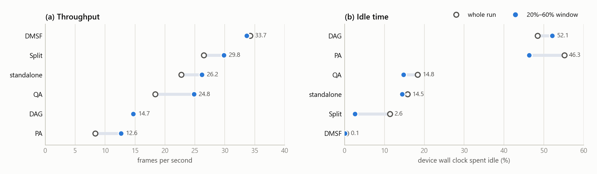

# Static network — steady state only (20–60% window)

Every figure here covers **the middle of each run**: the stretch between 20% and
60% of its completed batches. The opening fifth is ramp-up — workers registering,
queues filling. The closing 40% is drain — fast devices idle while stragglers
finish. Neither says much about how a configuration performs while it is actually
working.

## What windowing changes

| System | fps, whole run | fps, 20–60% window | change |
|---|---:|---:|---:|
| QA | 18.4 | 24.8 | **+35%** |
| PA | 8.4 | 12.6 | **+51%** |
| standalone | 22.7 | 26.2 | +15% |
| Split | 26.5 | 29.8 | +13% |
| DMSF | 34.3 | 33.7 | −2% |
| DAG | 14.7 | 14.7 | 0% |

**The size of the correction is itself the result.** DMSF and DAG barely move —
their run totals were already measuring steady state. QA and PA move by a third
to a half, meaning a large part of their headline number was ramp-up and drain
rather than throughput. Comparing whole-run figures across those two groups
compares different things.

Idle time moves the same way and further: PA reads 55% idle over the whole run
and 46% inside the window; Split reads 11.4% against 2.6%. Most of Split's
apparent idleness was the pipeline filling and draining, not waste.

## The figures

| File | What it shows |
|---|---|
| [`window_vs_run.png`](window_vs_run.png) | Rolling throughput against run progress, one panel per system, window shaded |
| [`overview.png`](overview.png) | The windowed headline measures together |
| [`throughput.png`](throughput.png) | Windowed frames per second |
| [`timeline.png`](timeline.png) | Where each run's window falls on its own clock |
| [`panels.png`](panels.png) | Per-system detail within the window |

`window_vs_run.png` is the argument for the whole case: the shape of each curve
differs per system, and a flat curve means the window changes nothing while a
sloped one means the run total was measuring ramp-up.

## What can and cannot be windowed

| Metric | Source | Windowed |
|---|---|---|
| Throughput | `batch_done_ns.log` — one stamp per completion | yes |
| Idle / free time | `free_time_series.log` — per device, per bucket | yes |
| Bytes per frame | `message_size_series.log` — per message | yes |
| Latency percentiles | run-level rollup only | no |

Two clocks are in play, so the window is applied twice over. `batch_done_ns.log`
and `broker_ram_ns.log` carry absolute nanosecond stamps, so the window is a
wall-clock interval. `free_time_series.log` and `message_size_series.log` carry
`t_offset_s` relative to each device's own start, and devices start and stop at
different times — those are windowed against each device's own span, which is the
right question anyway: was *this* device idle during *its* steady state.

## Caveats

**Message counts inside the window are small** — 8 to 19 per run. The windowed
bytes-per-frame figures are consistent with the whole-run ones, but they rest on
few samples and should not be read to three decimal places.

**PA's counter disagreement carries into the window.** Its windowed 12.6 fps
corrects to 25.3 fps on the same basis as in the all-projects case, and the
charts mark it rather than substituting it.

**Broker RAM is not windowable for every run** — where the sampler was disabled
there is nothing to cut, and those cells are blank rather than zero.

Source: `visual_results/compare_window.ipynb` over `results static network/`.
